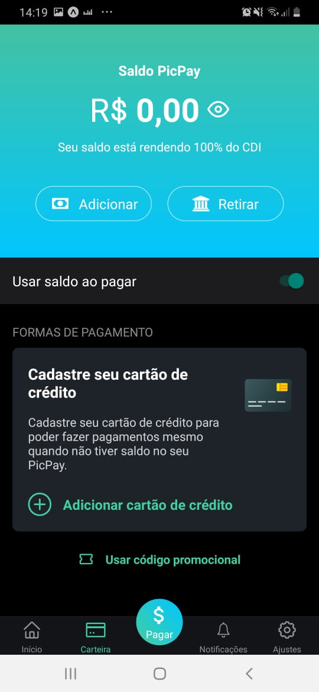
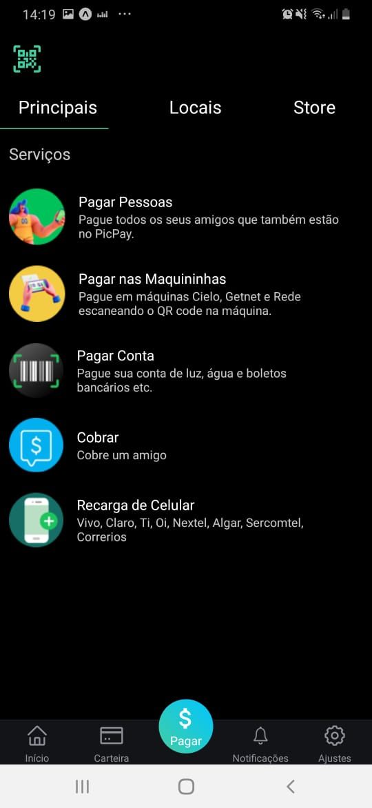

<h1 align="center">
<br>
Clone PicPay
<br>
<br>

</h1>

<p align="center">Este projeto é um clone (apenas front) do app PicPay. O intuito dele é treinar algumas funções do React Native.</p>

<h1>💻Ferramentas Utilizadas</h1>
<h2>Recurso</h2>
<p>Para o desenvolvimento do projeto foi utilizada a seguinte tecnologia:</p> 

- ⚛️ **React Native** — Uma lib que permite criar apps nativos para Android e iOS (neste projeto foi utilizado o JS).
<br>
<h2>🚀Tecnologias</h2>
<h4>📱Mobile:</h4>
<ul>
 <li><a href="https://reactnative.dev/">React Native</a></li>
 <li><a href="https://expo.io/">Expo</a></li>
</ul>

<h2>📚Instalação</h2>
<h3>Mobile</h3>
<p>Clone esse projeto em seu computador e siga os seguintes passos:</p>

```
-> Não é necessário executar a linha abaixo caso você já possua o Expo (CLI) instalado.
yarn global add install expo-cli
npm install
npm start
```

## Referências
 - Parte desse conteúdo foi retirado dos vídeos: https://www.youtube.com/watch?v=0CraBZHejKI&t=1478s, https://www.youtube.com/watch?v=m5w6GcEhteM e https://www.youtube.com/watch?v=fiuWVbnBIpo


## Imagens do projeto final
<h1 align="center">
  
 
</h1>


